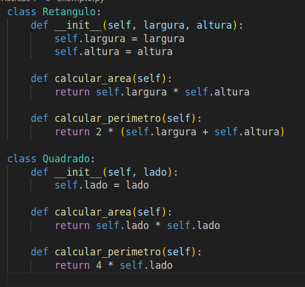
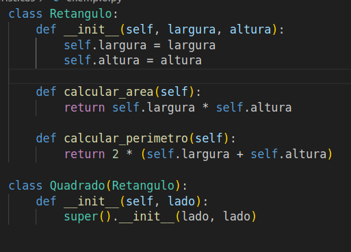

# Ausência de duplicidade

Ausência de duplicidade em códigos é um princípio de programação que preconiza a eliminação de redundâncias e repetições no código-fonte. Esse conceito busca garantir que cada trecho de lógica ou funcionalidade seja implementado apenas uma vez no sistema, evitando a repetição desnecessária de linhas de código. Isso não apenas facilita a manutenção e o entendimento do código, mas também reduz a probabilidade de erros introduzidos por alterações inconsistentes em partes duplicadas do programa. A ausência de duplicidade contribui para a clareza, eficiência e qualidade global do software, promovendo uma abordagem mais concisa e sustentável no desenvolvimento de sistemas.

#### Aqui estão alguns dos impactos resultantes dessa característica:

- **Redução de Tamanho:**
  - A eliminação de duplicidade de código resulta em um código mais enxuto e conciso, reduzindo o tamanho total do código.

- **Facilita Manutenção:**
  - Código sem duplicidade é mais fácil de ser mantido, uma vez que as alterações precisam ser feitas em um único local, evitando problemas de inconsistência.

- **Promove a Consistência:**
  - Eliminar duplicidade contribui para a consistência do código, garantindo que a lógica seja a mesma em todos os lugares onde é aplicada.

- **Facilita a Identificação de Erros:**
  - Duplicidade de código pode introduzir erros quando uma versão é corrigida e a outra é esquecida. Eliminar duplicidade ajuda a evitar esse tipo de problema.

- **Melhora a Legibilidade:**
  - Código sem duplicidade é mais legível, uma vez que não há necessidade de entender várias instâncias da mesma lógica.

## Relação com “code smells”:
- **Código Duplicado:**
  - A presença de código duplicado é um claro indicativo de falta de eliminação de duplicidade.

- **Método Longo:**
  - Métodos longos muitas vezes resultam em trechos de código duplicado. A refatoração para eliminar duplicidade pode envolver a quebra desses métodos.

- **Classe Grande:**
  - Classes extensas podem conter duplicidade de código. A divisão dessas classes pode ajudar a eliminar a duplicidade.

## Operação de Refatoração

- **Extrair Método:**
  - Identificar trechos de código duplicados e extrair a lógica para um método separado, que pode ser chamado em diferentes partes do código.

- **Introduzir Factory Method:**
  - Quando há a criação de objetos duplicada, introduzir um Factory Method pode eliminar essa duplicidade.

- **Herança ou Composição:**
  - Em casos de duplicidade em classes, considerar a utilização de herança ou composição para compartilhar ou reutilizar código.

- **Template Method:**
  - Quando métodos têm estruturas semelhantes, aplicar o padrão Template Method pode ser uma maneira de eliminar duplicidade.

## Exemplo de documentação com duplicidade:

Apresentamos um exemplo de código que possui duplicidade, tornando-a confusa, extensa e pouco eficaz para entender o conceito do projeto:

## Exemplo de documentação sem duplicidade:

Aqui está um exemplo de código que evita duplicidade, proporcionando uma compreensão clara, detalhada e reduzida sobre o sistema:

