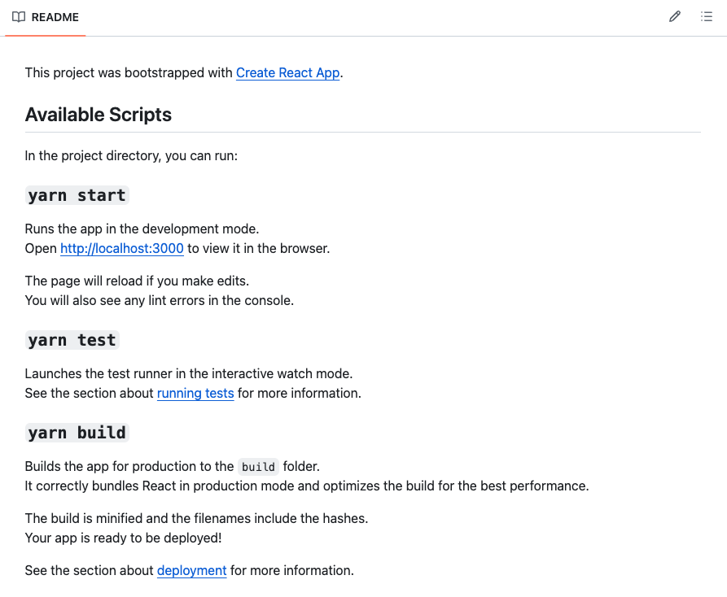
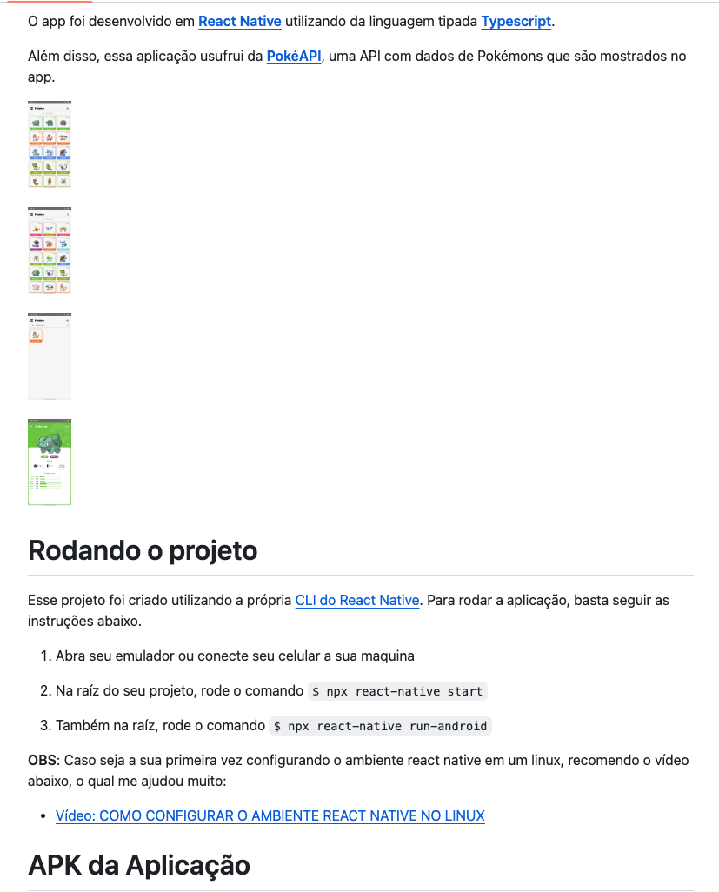

# Boa documentação

A boa documentação de software é um elemento essencial no desenvolvimento de sistemas, desempenhando um papel crítico ao facilitar a compreensão, manutenção e colaboração eficaz entre os membros desenvolvedores. Uma documentação eficiente vai além de apenas descrever o que o código faz, ela fornece um contexto geral, explica decisões de negócio, orienta o desenvolvedor e oferece suporte para uma evolução continua do software.

#### Aqui estão alguns dos impactos resultantes dessa característica:

- **Facilita a Compreensão do Código:** Desenvolvedores podem entender mais rapidamente a lógica, a estrutura e o propósito do código, facilitando de forma significativa na sua colaboração;
- **Reduz o Tempo de Integração de Novos Membros:** Membros novos da equipe podem se integrar mais rapidamente no desenvolvimento do projeto, aproveitando a documentação como uma referência sobre o sistema;
- **Promove a Padronização:**  Estabelece padrões de codificação, diretrizes e boas práticas, contribuindo para a consistência em toda a base de código. Dessa forma, evita a introdução de código repetido ou complexo;
- **Aumenta a Eficiência na Resolução de Problemas:** Ajuda na identificação e resolução de problemas, uma vez que os desenvolvedores podem se referir à documentação para entender a origem de questões e bugs.;

## Relação com “code smells”:

- **Mudanças divergentes:** Um *"code smell"* que a documentação ajuda muito a evitar é a de *"mudanças divergentes"*. Em resumo, uma mudança divergente ocorre quando uma única classe é modificada frequentemente para dar suporte a diferentes funcionalidade, indicando falta de coesão já que a classe está acumulando responsabilidades. Isso é evitado com uma boa documentação, já que as regras de negócios e as responsabilidades de cada classe são elaboradas desde sua conceitualização no documento. Dessa forma, quando for necessário alterar um classe, já vai ser levado em consideração a responsabilidade específica que ela tem;
- **Cirurgia com rifle:** O *“code smell”* cirurgia com rifle refere-se a uma situação que no caso uma única alteração no código necessita de modificações em outras várias partes diferentes do projeto, cada alteração é como se fosse um tiro de espingarda que atinge diversos locais diferentes. Com a prática de uma boa documentação esse *“code smell”* tende a ser mitigado de forma efetiva, já que uma documentação eficiente proporciona clareza e compreensão sobre a estrutura e arquitetura do software desenvolvido. Assim send, uma documentação descente teriam regras de design e práticas que levem a evitar esse tipo de problema.

## Exemplo de documentação ruim:

Segue um exemplo ruim de uma documentação de configuração do projeto, pouco detalhada e que nem da para entender o conceito do mesmo:

## Exemplo de documentação bos:

Segue um bom exemplo de uma documentação de configuração do projeto, que além de detalhar como rodar o projeto direito, dá uma contextualização sobre o mesmo:

OBS: Os exemplos acima foram dados no contexto de **configuração de um projeto**. Contudo, é importante ressaltar que uma boa documentação vai muito além disso, é importante ter diversos documentos sobre a arquitetura do projeto, diagramas utilizados, fluxo do usuário, regras de negócio do código, entre outros.