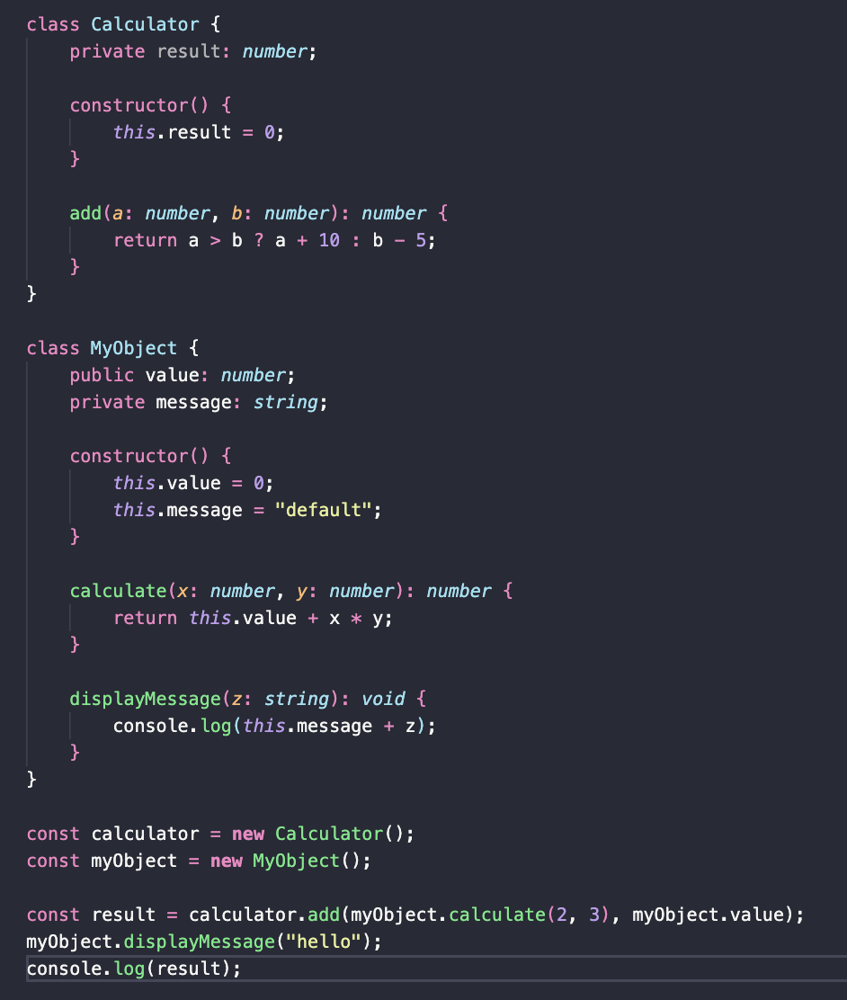

# Elegancia

Um código elegante é um código fonte que não apenas funciona corretamente, mas também é bem escrito, fácil de entender, eficiente, e que segue boas práticas de programação. A elegância no código é subjetiva e pode variar dependendo do contexto e das preferências da equipe, mas geralmente inclui os seguintes atributos: Identação, padrões de estruturação, padrões de nomeclatura compreensiveis, boas práticas de projeto e modularização padronizada.

#### Aqui estão alguns dos impactos resultantes dessa característica:

- **Facilidade de manutenção:** Códigos elegantes são mais fáceis de entender, facilitando a manutenção contínua. Desenvolvedores podem localizar e corrigir problemas mais rapidamente;
- **Rápida adaptação a mudanças:** Um código elegante é mais flexível e pode se adaptar facilmente a mudanças nos requisitos;
- **Aceleração do desenvolvimento:**  Desenvolvedores podem progredir mais rapidamente em um código elegante, uma vez que fica mais fácil de entender e, consequentemente, atuar no projeto;
- **Facilidade de integração à outras bibliotecas:** Códigos elegantes são mais fáceis de integrar com outros sistemas e bibliotecas, uma vez que seguem padrões e boas práticas comuns.

## Relação com “code smells”:

- **Código duplicado:** Um *"code smell"* que a elegancia ajuda muito a evitar é a de *"código duplicado"*. Em resumo, com um código elegante, seguindo o atributo de modularização padronizado que foi anteriormente citade, evita a introdução de código já existente dentro do projeto, já que o desenvolvedor consegue identificar rápidamente o modulo que ele necessita para realizar sua funcionalidade, ao invés de criar um novo;
- **Longa lista de parâmetros:** Outro *"code smell"* que a elegancia evita bastante é a de longa lista de parâmetros, já que ao se ter um código elegante o desenvolvedor sempre busca a implementar metodos que visem utilizar menos parâmetros e, por consequencia, busca também torná-lo mais simples e menos complexo. 

## Exemplo de código não elegante:

## Exemplo de código elegante:

