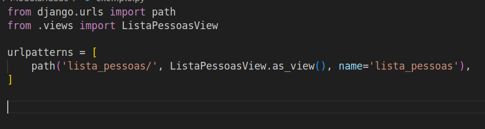
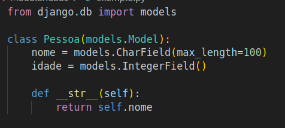
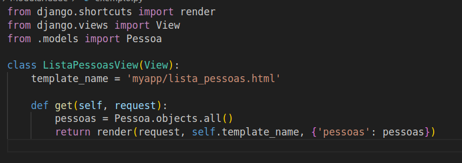

# Modularidade

A modularidade refere-se à capacidade do software de ser dividido em módulos independentes e bem definidos. Módulos são unidades funcionais que têm responsabilidades específicas e interagem entre si de maneira clara. Essa característica visa promover a organização e a separação de preocupações no código.

#### Aqui estão alguns dos impactos resultantes dessa característica:

- **Estrutura Clara:**
  - A modularidade promove uma estrutura clara no código, onde cada parte tem um propósito bem definido e é facilmente identificável. Módulos independentes ajudam a organizar o código de maneira lógica.

- **Claridade:**
  - A divisão do software em módulos contribui para uma maior claridade. Cada módulo representa uma funcionalidade específica, facilitando a leitura e compreensão do código. Isso resulta em uma compreensão mais rápida e eficaz do que está sendo feito.

- **Manutenibilidade:**
  - A modularidade melhora a manutenibilidade do código. Com módulos bem definidos, as atualizações e correções podem ser implementadas de forma mais rápida e fácil. Entender como o sistema funciona torna-se ágil devido à clareza na separação de responsabilidades.

- **Redução de Erros:**
  - Simplificar o código por meio da modularidade ajuda significativamente na redução de erros. Módulos independentes e coesos facilitam a identificação e correção de problemas, melhorando a confiabilidade do software.

- **Facilita Reutilização de Código:**
  - Módulos bem definidos podem ser reutilizados em diferentes partes do projeto ou em projetos futuros. Isso economiza tempo e esforço, promovendo a eficiência no desenvolvimento.

- **Testabilidade Aprimorada:**
  - Módulos independentes são mais fáceis de serem testados individualmente. Isso facilita a implementação de testes unitários, contribuindo para a qualidade do software.

- **Escalabilidade:**
  - A modularidade facilita a escalabilidade do software. Novas funcionalidades podem ser adicionadas de forma mais organizada e sem afetar negativamente as partes existentes do sistema.

- **Colaboração Eficiente:**
  - A equipe de desenvolvimento pode trabalhar de maneira mais eficiente, pois diferentes membros podem se concentrar em módulos específicos, evitando conflitos e facilitando a colaboração.

- **Documentação Simplificada:**
  - Módulos bem definidos e independentes facilitam a documentação do código. Cada módulo pode ser descrito separadamente, contribuindo para uma documentação mais clara e acessível.

## Relação com “code smells”:
- **Dependências Externas Excessivas:**
  - Quando um módulo depende excessivamente de outros, isso pode indicar baixa modularidade.
- **Baixa Coesão:**
  - Módulos com funcionalidades misturadas indicam baixa coesão, prejudicando a modularidade.
- **Acoplamento Forte:**
  - Alto acoplamento entre módulos é contraproducente para a modularidade.

## Operação de Refatoração
- **Extrair Módulo:**
  - Identificar funcionalidades relacionadas em um módulo e extrair essas funcionalidades para criar um novo módulo.
- **Dividir Classes:**
  - Se um módulo contém classes com responsabilidades distintas, dividir essas classes em módulos separados.

## Exemplo de Modularidade:
  - Entre os exemplos de modularidade podemos citar diversos framworks que separam as atribuições de códigos em diferentes módulos, como por exemplo o Django do python.

- **Figura 1: Modularização no Django - urls**
  - Nesta figura, observamos o módulo responsável pela gestão das URLs no framework Django. A separação de funcionalidades em módulos específicos, como este, contribui para uma organização eficiente do código.

  

- **Figura 2: Modularização no Django - models**
  - O módulo de models no Django é destacado nesta figura, evidenciando a separação de responsabilidades ao lidar com a definição e estruturação dos dados do aplicativo. A modularidade facilita a manutenção e compreensão do sistema.

  

- **Figura 3: Modularização no Django - views**
  - Na terceira figura, é apresentado o módulo de views, responsável por processar as solicitações do usuário e retornar as respostas apropriadas. A clara modularização simplifica o desenvolvimento e a compreensão do código.

  
