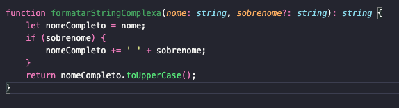
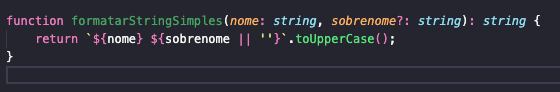

# Simplicidade

Simplicidade se refere a prática de buscar sempre manter a estruturação e a lógica do código de forma simples e direta, buscando evitar ao máximo alguma complexidade (Pete Goodliffe, 2026). Ela é uma das propríedades mais importantes de se manter dentro de um projeto. Um código simples ajuda a manter uma boa legibilidade do sistema, facilita na implementação de testes, reduz a complexidade presentes nas condições, além de, facilitar os desenvolvedores a entender a aplicação como um todo.

#### Aqui estão alguns dos impactos resultantes dessa característica:

- **Estrutura clara:** Cada parte do código terá um propósito claro e vai ser facilmente identificável;
- **Claridade:** É mais simples de ler e contribui para uma compreensão mais rápida e eficaz do que está sendo feito;
- **Manutenibilidade:**  Quando o código é simples, as atualizações e correções são mais rápidas e mais fáceis de serem implementadas, já que é mais ágil entender como o sistema funciona;
- **Redução de Erros:** Simplificar o código ajuda a reduzir a chance de erros e melhora a confiabilidade do software;

## Relação com “code smells”:

- **Cadeias de mensagens:** Um exemplo de *“code smell”* que tende a violar o conceito de simplicidade é *“Cadeias de mensagens”*, ele ocorre quando um objeto chama outro objeto, que chama outro objeto, que chama outro objeto e vai seguindo esse padrão sucessivamente. Cadeias assim geralmente ocorrem por meio excessivo de métodos *“get”*, isso faz **com que seja utilizadas diversas variáveis presentes em objetos diferentes com lógicas diferentes, aumentando, assim,  a sua complexidade;
- **Método longo:** Métodos longos tendem a ser um tipo de *“code smell”* com muitas regras de negócio e lógicas envolvidas, resultando assim em métodos complexos e difíceis de entender e manipular.
- “**Classe grande”:** Outro *“code smell”*  que geralmente viola a definição de simplicidade é o de *“Classe grande”* já que uma classe grande demais tende a ser uma classe que busca assumir muita responsabilidade dentro do código e assim se na aplicação de diversas regras de negócio. Classes assim tem o costume de serem complexas, além de serem difíceis de se entender e manter.

## Exemplo de código complexo:

## Exemplo de código simples:

